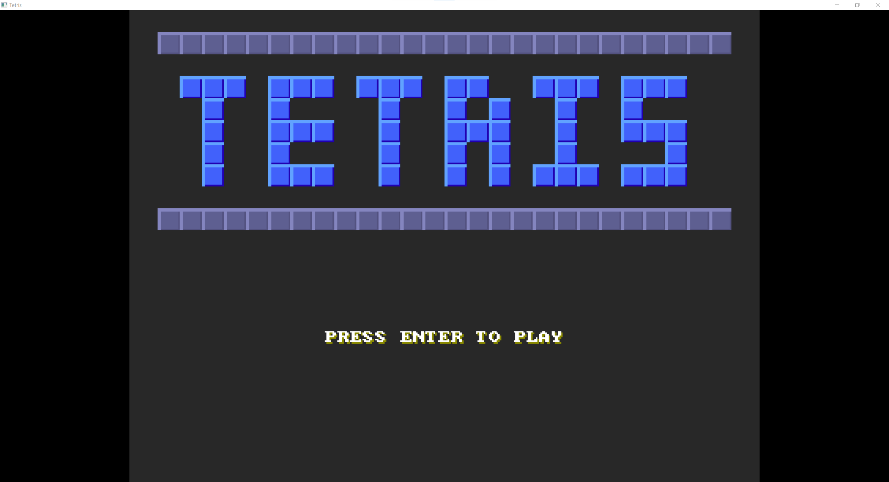
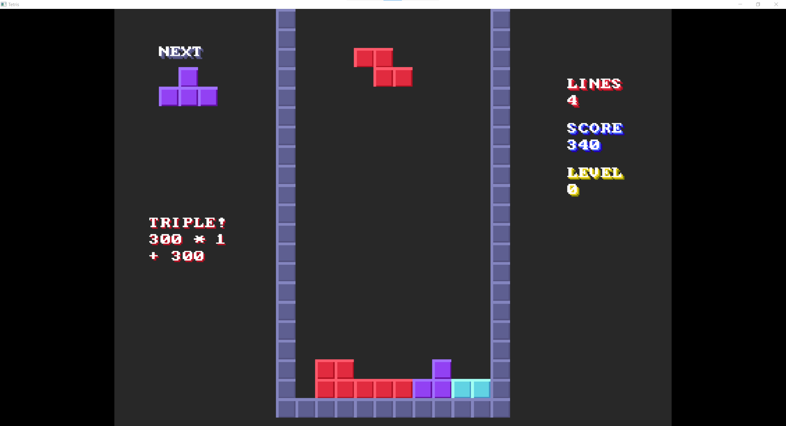
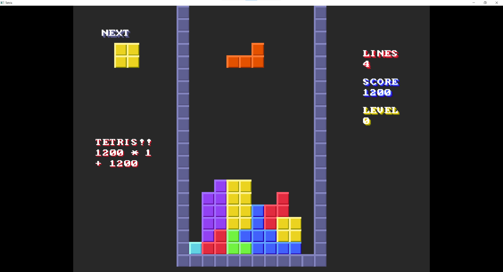
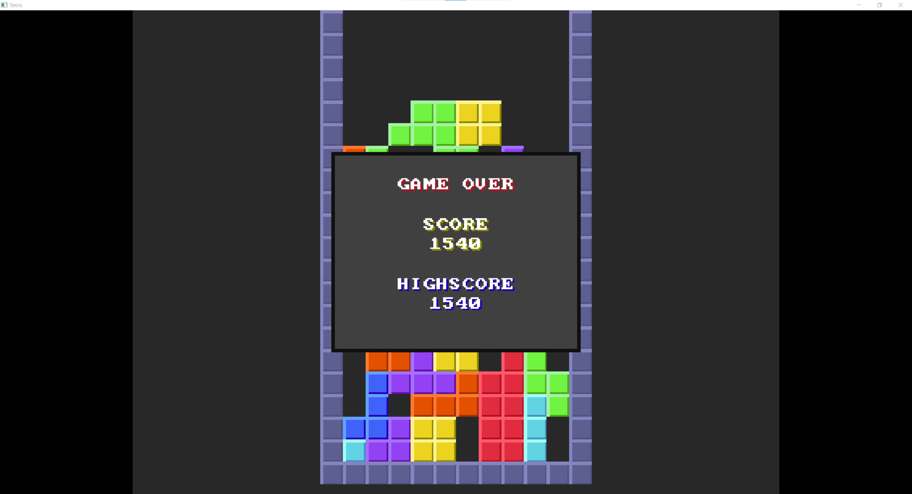

# Win32-Tetris
This is a Tetris application made entirely using only the C programming language and the Win32 API. It uses a 400x300 device-independent bitmap (DIB) for rendering the graphics using the Windows Graphics Device Interface `gdi32.lib` library.

## Building
The binaries are provided in the Release section but if you want to build it yourself, the `build.bat` file essentially contains everything you need to know to do so.

It's a Unity build, all source files are included directly or indirectly in `main.c` using `#include`.

You only need to compile `main.c` and link 2 Windows libraries: `user32.lib` and `gdi32.lib`.

In the batch file, I use the clang compiler, but any compiler should work just fine.

## Screenshots

